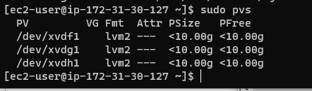
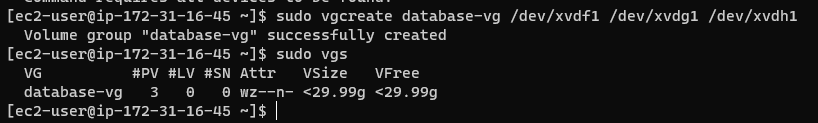
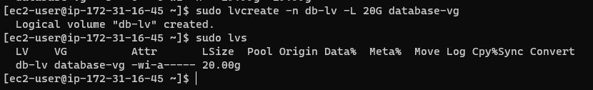
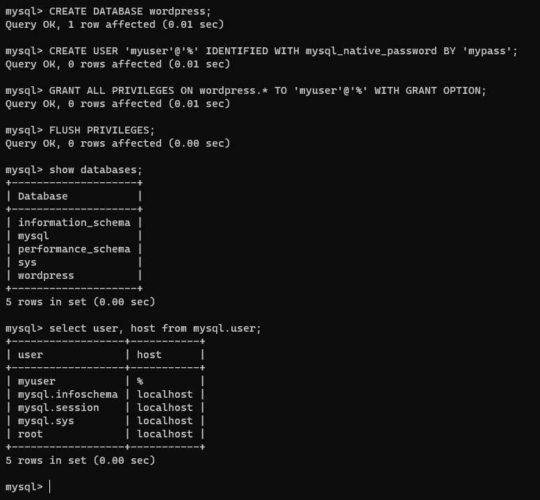
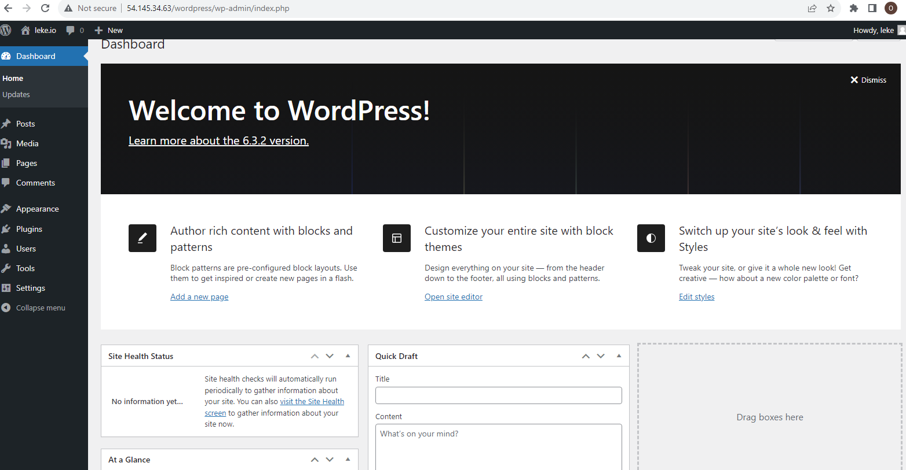

# WEB SOLUTION WITH WORDPRESS
In this project we are tasked to prepare storage infrastructure on two Linux servers and implement a basic web solution using WordPress. WordPress is a free and open-source content management system written in PHP and paired with **MySQL** or **MariaDB** as its backend Relational Database Management System (RDBMS).

The Project 6 consists of two parts:

1. Configure storage subsystem for Web and Database servers based on Linux OS. The focus of this part is to give you practical experience of working with disks, partitions and volumes in Linux.

2. Install WordPress and connect it to a remote MySQL database server. This part of the project will solidify your skills of deploying **Web and DB** tiers of Web solution.
As a DevOps engineer, your deep understanding of core components of web solutions and ability to troubleshoot them will play essential role in your further progress and development.

Three-tier Architecture
Generally, **web**, or **mobile** solutions are implemented based on what is called the Three-tier Architecture.

## Three-tier Architecture is a client-server software architecture pattern that comprise of 3 separate layers.

1. Presentation Layer (PL): This is the user interface such as the client server or browser on your laptop.
2. Business Layer (BL): This is the backend program that implements business logic. Application or Webserver
3. Data Access or Management Layer (DAL): This is the layer for computer data storage and data access. Database Server or File System Server such as FTP server, or NFS Server

In this project, you will have the hands-on experience that showcases Three-tier Architecture while also ensuring that the disks used to store files on the Linux servers are adequately partitioned and managed through programs such as **gdisk and LVM** respectively.

## 3-Tier Setup
1. A Laptop or PC to serve as a client
2. An EC2 Linux Server as a web server (This is where you will install WordPress)
3. An EC2 Linux server as a database (DB) server

## RedHat OS was adopt for this project

## Step 1       
— Prepare a Web Server

1. An EC2 instance was launch that served as “Web Server”. Three (3) volumes created in the same availability zone AZ as the Web Server EC2 each of 10 GiB.

2. All three volumes attached to the Web Server EC2 instance one by one.

3. The **lsblk command** was used to inspect what block devices are attached to the server. Notice names of your newly created devices. All devices in Linux reside in **/dev/ directory**. Inspect it with ls /dev/ and make THe 3 newly created block devices names are xvdf, xvdg and xvdh as presented.  

4. The **gdisk utility** used to create a single partition on each of the 3 disks

5. The **lvm2 package** were Installed using **sudo yum install lvm2**.  
Run sudo lvmdiskscan command to check for **available partitions**.

6. We Used **pvcreate utility** to mark each of 3 disks as physical volumes (PVs) to be used by LVM

*sudo pvcreate /dev/xvdf1*
*sudo pvcreate /dev/xvdg1*
*sudo pvcreate /dev/xvdh1*

7. Verify that your Physical volume has been created successfully by running sudo pvs

*sudo pvs*

8. Use vgcreate utility to add all 3 PVs to a volume group (VG). Name the VG webdata-vg

*sudo vgcreate webdata-vg /dev/xvdh1 /dev/xvdg1 /dev/xvdf1*

9. We Verify that your VG has been created successfully by running.  
*sudo vgs*

10. Use **lvcreate utility** to create 2 logical volumes. apps-lv (Use half of the PV size), and logs-lv Use the remaining space of the PV size. NOTE: apps-lv will be used to store data for the Website while, logs-lv will be used to store data for logs.

*sudo lvcreate -n apps-lv -L 14G webdata-vg*
*sudo lvcreate -n logs-lv -L 14G webdata-vg*

11. Verify that your Logical Volume has been created successfully by running sudo lvs

*sudo lvs*

12. Verify the entire setup

*sudo vgdisplay -v #view complete setup - VG, PV, and LV*

Use mkfs.ext4 to format the logical volumes with ext4 filesystem

*sudo mkfs.ext4 /dev/webdata-vg/apps-lv*

*sudo mkfs.ext4 /dev/webdata-vg/logs-lv*
	
14. Create /var/www/html directory to store website files
*sudo ls -l /var*

to confirm if www existing 

*sudo mkdir -p /var/www/html*

15. Create /home/recovery/logs to store backup of log data

*sudo mkdir -p /home/recovery/logs*

check if there is a content inside

*ls -l /var/www/html*

16. Use rsync utility to backup all the files in the log directory /var/log into /home/recovery/logs 

*sudo rsync -av /var/log/. /home/recovery/logs/*

17. Mount /var/www/html on apps-lv logical volume

*sudo mount /dev/webdata-vg/apps-lv /var/www/html/*

18. Restore log files back into /var/log directory

*sudo rsync -av /home/recovery/logs/log/. /var/log*

19. Update /etc/fstab file so that the mount configuration will persist after restart of the server.
The UUID of the device will be used to update the /etc/fstab file;

*sudo blkid*

## PREPARE THE DATABASE SERVER

Step 2  
 — Prepare the Database Server

The second RedHat EC2 instance was launch that served a role – ‘DB Server’

The process was repeat the same steps as for the Web Server, but instead of **apps-lv create db-lv and mount it to /db directory instead of /var/www/html/.**

After duly follow the process in step one, the following images were obtained.

- Use **gdisk utility** to create a single partition on each of the 3 disks

- Install lvm2 package using sudo yum install lvm2. Run sudo lvmdiskscan command to check for available partitions.

*sudo yum install lvm2*

- Use **pvcreate utility** to mark each of 3 disks as physical volumes (PVs) to be used by LVM

*sudo pvcreate /dev/xvdf1 /dev/xvdg1 /dev/xvdh1*

*sudo pvs*

- Use **vgcreate utility** to add all 3 PVs to a volume group (VG). Name the VG webdata-vg

*sudo vgcreate database-vg /dev/xvdh1 /dev/xvdg1 /dev/xvdf1*

Verify that your VG has been created successfully by running sudo vgs

*sudo vgs*

- Use **lvcreate utility** to create 2 logical volumes. apps-lv (Use half of the PV size), and logs-lv Use the remaining space of the PV size. NOTE: apps-lv will be used to store data for the Website while, logs-lv will be used to store data for logs.

*sudo lvcreate -n db-lv -L 20G database-vg*

- Verify that your Logical Volume has been created successfully by running sudo lvs

*sudo lvs*

- create mount point

*sudo mkdir /db*

- Use mkfs.ext4 to format the logical volumes with ext4 filesystem

*sudo mkfs.ext4 /dev/database-vg/db-lv*

- mount

*sudo mount /dev/database-vg/db-lv /db*

*sudo df -h

## Step 3 Install WordPress on your Web Server EC2

- Update the repository

*sudo yum -y update*

- Install wget, Apache and it’s dependencies

*sudo yum -y install wget httpd php php-mysqlnd php-fpm php-json*

- Start Apache

*sudo systemctl enable httpd*

*sudo systemctl start httpd*

- To install PHP and it’s depemdencies

*sudo yum install https://dl.fedoraproject.org/pub/epel/epel-release-latest-8.noarch.rpm*

*sudo yum install yum-utils http://rpms.remirepo.net/enterprise/remi-release-8.rpm*

*sudo yum module list php*

*sudo yum module reset php*

*sudo yum module enable php:remi-7.4*

*sudo yum install php php-opcache php-gd php-curl php-mysqlnd*

*sudo systemctl start php-fpm*

*sudo systemctl enable php-fpm*

*sudo setsebool -P httpd_execmem 1*

- Restart Apache

*sudo systemctl restart httpd*

- Download wordpress and copy wordpress to var/www/html
  
*sudo mkdir wordpress*

*cd   wordpress*

*sudo wget http://wordpress.org/latest.tar.gz*

*sudo tar xzvf latest.tar.gz*

*sudo rm -rf latest.tar.gz*

*cp wordpress/wp-config-sample.php*

*wordpress/wp-config.php*

*cp -R wordpress /var/www/html/*

- Configure SELinux Policies

*sudo chown -R apache:apache /var/www/html/wordpress*

*sudo chcon -t httpd_sys_rw_content_t /var/www/html/wordpress -R*

*sudo setsebool -P httpd_can_network_connect=1*

Step 4 — Install MySQL on your DB Server EC2

Verify that the service is up and running by using **sudo systemctl status mysqld**, if it is not running, restart the service and enable it so it will be running even after reboot:

- Mysql Secure Installation

*sudo mysql*

### CREATE DATABASE wordpress;

### CREATE USER 'myuser'@'%' IDENTIFIED WITH mysql_native_password BY 'mypass';

### GRANT ALL PRIVILEGES ON wordpress.* TO 'myuser'@'%' WITH GRANT OPTION;
### FLUSH PRIVILEGES;

### Exit

- DB server confirmation after daemon reload

- Login to database server from web server

- Confirm mysql is up and running 

- Reload Apache Web Server public IP address on web browser

- Create Login Details

- Login with Credential

- Wordpress successfully installed

kindly refer to below link for complete stages explanation 

[Darey.io Project 6](https://www.dareyio.com/docs/update-the-etc-fstab-file/)

> *The documentation can be modify later to effect changes using dedicated and restricted ip address for the servers*

| Name | Description | Date |
|:---  |    :----:   |  ---:| 
|Olaolu| Pro-6 Wordpress & Database  |28-10-23| 

*Thank you*
